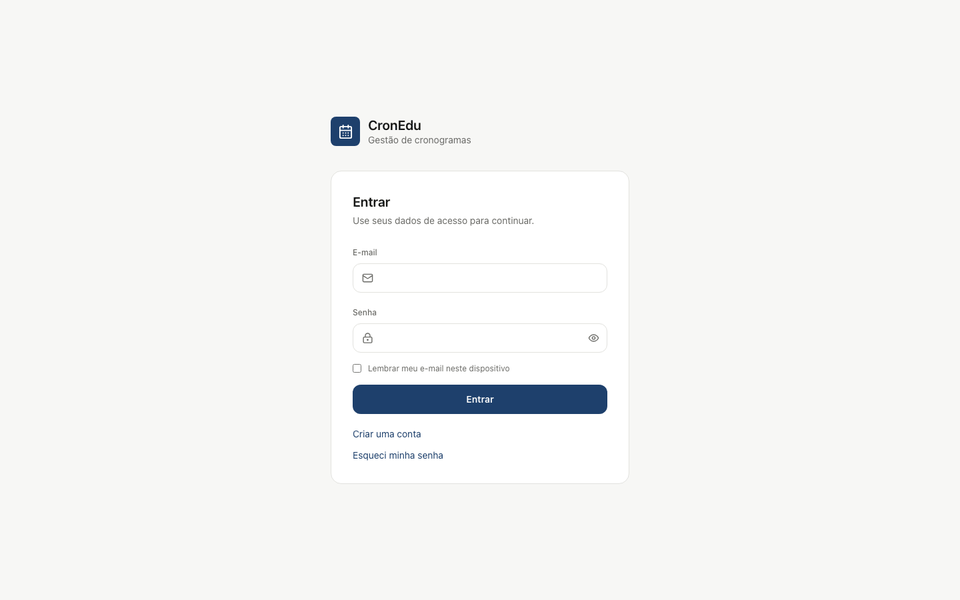

# CronEdu

Sistema de geração e gestão de cronogramas acadêmicos: cadastre cursos, módulos e disciplinas, gere automaticamente as datas das aulas (pulando feriados e recessos), planeje o conteúdo de cada aula, acompanhe relatórios e receba alertas antes de cada encontro.

Feito para coordenadores e professores que organizam a agenda de cursos, MBAs, pós-graduações e afins.

> Código aberto para uso, estudo, modificação e contribuição — mas **não para uso comercial** —, licenciado sob [PolyForm Noncommercial 1.0.0](LICENSE). Contribuições são bem-vindas — veja [Contribuindo](#contribuindo).



---

## Índice

- [Funcionalidades](#funcionalidades)
- [Stack](#stack)
- [Pré-requisitos](#pré-requisitos)
- [Começando (desenvolvimento local)](#começando-desenvolvimento-local)
- [Variáveis de ambiente](#variáveis-de-ambiente)
- [Criando a primeira conta de administrador](#criando-a-primeira-conta-de-administrador)
- [Testes](#testes)
- [Migrações de banco de dados](#migrações-de-banco-de-dados)
- [Estrutura do projeto](#estrutura-do-projeto)
- [Deploy em produção](#deploy-em-produção)
- [Segurança e privacidade (LGPD)](#segurança-e-privacidade-lgpd)
- [Contribuindo](#contribuindo)
- [Licença](#licença)
- [Changelog](CHANGELOG.md)

---

## Funcionalidades

**Cadastro acadêmico**
- Cursos → Módulos → Disciplinas, cada um isolado por professor (cada conta só vê e gerencia o próprio catálogo; administradores veem tudo).
- Reaproveitamento de disciplinas já cadastradas ao montar um novo módulo.

**Geração de cronograma**
- Gera automaticamente as datas de aula a partir de período, recorrência (semanal, quinzenal ou evento único), dias da semana e horário.
- Pula feriados e recessos automaticamente, com três políticas configuráveis: remarcar automaticamente, remarcar manualmente ou simplesmente não remarcar.
- Avisa (sem bloquear) quando uma aula cai na véspera ou no dia seguinte a um feriado, e quando duas aulas do mesmo professor colidem de horário.
- Antes de confirmar, dá para desmarcar ou remarcar aulas específicas sem regenerar o cronograma inteiro.
- Depois de salvo, cada aula pode ser remarcada ou cancelada individualmente a qualquer momento (com motivo obrigatório), sem afetar as demais.

**Importação de cronograma**
- Sobe uma planilha (`.csv`/`.xls`/`.xlsx`, mesmo layout da exportação) e o sistema cria automaticamente curso/módulo/disciplina/aulas, reaproveitando o que já existir por nome.

**Planejamento de aulas**
- Plano de Trabalho Docente (PTD) por disciplina: ementa, objetivos, conteúdo programático, metodologia, avaliação, bibliografia.
- Roteiro por aula (tema do dia, atividades) com anexos de materiais (cifrados em repouso — veja [Segurança e privacidade](#segurança-e-privacidade-lgpd)).
- Exportação do PTD e do roteiro de cada aula em `.docx` e `.pdf`.
- Envio do roteiro e dos anexos de uma aula por e-mail direto para os alunos.
- Link público de compartilhamento dos anexos de uma aula (sem exigir login), com expiração automática em 7 dias e revogação a qualquer momento.

**Minha Semana**
- Visão semanal (dia a dia, com navegação entre semanas) de todas as aulas do professor, agrupadas por disciplina e curso.
- Mini calendário no topo mostrando os horários ocupados de cada dia da semana, com clique para abrir direto o roteiro/materiais daquela aula.
- Mesmo fluxo de planejamento (roteiro, anexos, exportação, e-mail, link público, remarcação/cancelamento) disponível direto na visão semanal, sem precisar entrar em cada disciplina.

**Feriados e recessos**
- Cadastro manual ou importação de planilha com um ano inteiro de feriados de uma vez.

**Alertas**
- Lembretes configuráveis (in-app e e-mail) antes de cada aula.
- Assinatura da agenda de aulas via link `.ics` (Google Calendar, Outlook, Apple Calendar).

**Relatórios**
- Total de aulas e horas lecionadas, disciplinas e instituições mais lecionadas, proporção presencial × remoto.

**Autenticação e privacidade**
- Login por e-mail/senha ou Google OAuth, sessão via cookie httpOnly + proteção CSRF.
- Exportação e exclusão dos próprios dados (LGPD), Termos de Uso e Política de Privacidade versionados.
- Gestão de usuários por administrador (convite, papel, remoção).

**Onboarding**
- Tour guiado interativo na primeira vez que a conta acessa o sistema, e uma Central de Ajuda para rever a qualquer momento.

---

## Stack

| Camada | Tecnologia |
|---|---|
| Backend | Python 3.11, FastAPI, SQLAlchemy, Alembic, Uvicorn |
| Banco de dados | SQLite (dev local) · PostgreSQL (produção — testado com [Neon](https://neon.tech)) |
| Autenticação | Cookies de sessão + CSRF double-submit, Google OAuth opcional |
| Exportação/relatórios | Pandas, Openpyxl, python-docx, ReportLab |
| Frontend | React 18, TypeScript, Vite |
| Estilo | Tailwind CSS |
| Ícones | Lucide React |
| HTTP | Axios |
| Testes | Pytest (backend) |

---

## Pré-requisitos

- **Node.js** 18 ou superior
- **Python** 3.11 (o backend é testado nessa versão; 3.10+ deve funcionar)
- **Git**

Nenhuma instalação de banco de dados é necessária para rodar localmente — o modo de desenvolvimento usa SQLite em um arquivo (`backend/sql_app.db`), criado automaticamente.

---

## Começando (desenvolvimento local)

### 1. Clonar o repositório

```bash
git clone https://github.com/seu-usuario/cronedu.git
cd cronedu
```

### 2. Instalar dependências

**Mac / Linux:**
```bash
npm run install:all
source backend/.venv/bin/activate
npm run setup:back
```

**Windows (PowerShell):**
```powershell
npm run install:all
.\backend\.venv\Scripts\activate
npm run setup:back
```

- `install:all` instala as dependências Node (raiz + frontend) e cria o ambiente virtual Python (`.venv`).
- `setup:back` instala os pacotes Python de dentro do `.venv` já ativado.

### 3. Configurar variáveis de ambiente

```bash
cp backend/.env.example backend/.env
cp frontend/.env.example frontend/.env
```

Para rodar localmente **os valores padrão já funcionam** — não é obrigatório editar nada nesta etapa. Veja [Variáveis de ambiente](#variáveis-de-ambiente) para entender o que cada uma faz e quais são realmente opcionais (Google Login, e-mail, alertas).

### 4. Subir o projeto

Sempre com o `.venv` do backend ativado:

**Mac / Linux:**
```bash
source backend/.venv/bin/activate
npm run dev
```

**Windows:**
```powershell
.\backend\.venv\Scripts\activate
npm run dev
```

Isso sobe backend e frontend ao mesmo tempo.

| Serviço | URL |
|---|---|
| Frontend | http://localhost:5173 |
| API (backend) | http://localhost:8000 |
| Documentação interativa da API (Swagger) | http://localhost:8000/docs |

Abra `http://localhost:5173`, clique em "Criar uma conta" e comece a usar. Veja a próxima seção para virar administrador.

### Dados de exemplo (opcional)

```bash
npm run seed:back
```

Semeia os feriados nacionais de 2026 e um recesso de fim de ano (dados globais, seguro rodar quantas vezes quiser). Para ganhar também um curso/módulo/disciplinas de demonstração vinculado à sua conta:

```bash
npm run seed:back -- --email=voce@example.com
```

(use o e-mail com o qual você já se cadastrou no sistema — o curso de exemplo precisa de um dono, já que o sistema isola dados por professor).

---

## Variáveis de ambiente

Todas as variáveis estão documentadas com comentários em [`backend/.env.example`](backend/.env.example) e [`frontend/.env.example`](frontend/.env.example). Resumo:

**Backend — funciona com os padrões, sem editar nada:**
- `DATABASE_URL` — `sqlite:///./sql_app.db` por padrão; em produção, uma URL Postgres.
- `ALLOWED_ORIGINS` — origens permitidas por CORS.
- `SESSION_DAYS`, `COOKIE_SECURE`, `COOKIE_SAMESITE` — configuração de sessão (os padrões servem para `http://localhost`).
- `LOG_PII_SALT` — chave usada para pseudonimizar IPs nos logs.
- `ATTACHMENT_ENCRYPTION_KEY` — chave usada para cifrar os anexos de aula em repouso. Funciona sem ela (usa uma chave gerada em memória), mas **em produção é obrigatório definir um valor fixo** — sem isso, cada reinício do servidor torna os anexos já enviados indecifráveis. Comando para gerar uma chave no próprio `.env.example`.

**Backend — opcionais (o sistema funciona sem, com aquela integração específica desligada):**
- `GOOGLE_OAUTH_CLIENT_ID` / `GOOGLE_OAUTH_CLIENT_SECRET` / `GOOGLE_OAUTH_REDIRECT_URI` — login com Google.
- `SMTP_*` — envio de e-mail (recuperação de senha, convite de usuário, alertas por e-mail).
- `ALERT_DISPATCH_TOKEN` — protege o endpoint que dispara os lembretes de aula; sem um agendador (cron) chamando esse endpoint periodicamente, os alertas não são enviados. Passo a passo completo no próprio `.env.example`.
- `BOOTSTRAP_ADMIN_EMAIL` / `BOOTSTRAP_ADMIN_TOKEN` — ver seção abaixo.
- `ADMIN_ACTION_TOKEN` — token extra para endpoints administrativos destrutivos em massa.

**Frontend:**
- `VITE_API_URL` — URL do backend (`http://localhost:8000` em dev).

---

## Criando a primeira conta de administrador

Por padrão, toda conta criada pelo cadastro público vira **professor** — ninguém vira admin sozinho, nem sendo a primeira conta do sistema. Para criar o primeiro administrador:

1. Defina `BOOTSTRAP_ADMIN_EMAIL` (o e-mail que será admin) e `BOOTSTRAP_ADMIN_TOKEN` (um segredo forte, gerado por você) no `backend/.env`, e reinicie o backend.
2. Cadastre essa conta enviando o header `X-Bootstrap-Admin-Token`:

   ```bash
   curl -X POST http://localhost:8000/auth/register \
     -H "Content-Type: application/json" \
     -H "X-Bootstrap-Admin-Token: <valor de BOOTSTRAP_ADMIN_TOKEN>" \
     -d '{"name":"Seu Nome","email":"<valor de BOOTSTRAP_ADMIN_EMAIL>","password":"uma-senha-forte-123456","privacy_consent":true}'
   ```

   (Se preferir, logar com Google usando esse mesmo e-mail também funciona, sem precisar do token — o Google já comprova que o e-mail é seu.)
3. Pronto — assim que esse admin existir, esse caminho se fecha sozinho. Novos administradores a partir daí são criados pelo próprio admin em **Usuários → Convidar**.

---

## Testes

```bash
cd backend
source .venv/bin/activate   # Windows: .venv\Scripts\activate
pytest tests/ -v
```

Os testes rodam contra um SQLite isolado em arquivo temporário (nada é escrito no seu `sql_app.db` de desenvolvimento). Cobrem autenticação, isolamento de dados entre professores, geração de cronograma, conflitos de horário, importação/exportação e o fluxo de PTD/roteiro de aula.

O frontend não tem suíte de testes automatizados ainda — ao mexer nele, rode pelo menos:

```bash
cd frontend
npm run build   # tsc --noEmit + build de produção
```

---

## Migrações de banco de dados

O schema é versionado com [Alembic](https://alembic.sqlalchemy.org/). Em desenvolvimento com SQLite, as tabelas são criadas automaticamente ao subir o backend. **Em produção com Postgres, as migrações precisam ser aplicadas explicitamente:**

```bash
npm run migrate:back
```

Para criar uma nova migração depois de alterar um modelo em `backend/app/models/base.py`:

```bash
cd backend
source .venv/bin/activate
alembic revision -m "descrição da mudança"
```

Edite o arquivo gerado em `backend/alembic/versions/` (as migrações deste projeto são escritas à mão, não com autogenerate, para manter controle fino sobre alterações não-destrutivas).

---

## Estrutura do projeto

```
cronedu/
├── backend/
│   ├── app/
│   │   ├── main.py                 # Composição da aplicação FastAPI, middlewares
│   │   ├── database.py             # Engine SQLAlchemy, sessão, pool de conexões
│   │   ├── dependencies.py         # Autenticação, checagem de posse, CSRF
│   │   ├── models/base.py          # Modelos SQLAlchemy (tabelas)
│   │   ├── schemas/                # Schemas Pydantic (validação de entrada/saída)
│   │   ├── routers/                # Um arquivo por domínio (academic, schedules, auth, alerts...)
│   │   ├── services/               # Lógica de geração de cronograma, importação, e-mail, PTD
│   │   └── middleware/             # Logging estruturado e cabeçalhos de segurança
│   ├── alembic/versions/           # Migrações do banco, em ordem cronológica
│   ├── tests/                      # Suíte Pytest
│   └── requirements.txt
├── frontend/
│   └── src/
│       ├── pages/                  # Uma página por rota (Dashboard, ScheduleForm, Reports...)
│       ├── components/             # Layout e componentes reutilizados entre páginas
│       ├── contexts/               # Auth, Toast, Confirm, Tema, Tour guiado
│       ├── api/client.ts           # Instância Axios (CSRF automático, sessão expirada)
│       └── types/domain.ts         # Tipos TypeScript compartilhados com o backend
├── render.yaml                     # Deploy do backend no Render
├── vercel.json                     # Deploy do frontend na Vercel
└── package.json                    # Scripts raiz (dev, install, setup, migrate)
```

---

## Deploy em produção

A configuração já está pronta em [`render.yaml`](render.yaml) (backend) e [`vercel.json`](vercel.json) (frontend) — normalmente basta apontar essas plataformas para o repositório.

**Backend (Render):**
1. Novo Web Service apontando para este repositório, com "Root Directory" = `backend`.
2. Configure as variáveis de ambiente de produção (ver `backend/.env.example`) no painel do Render — principalmente `DATABASE_URL` (Postgres) e `ALLOWED_ORIGINS`.
3. O build já roda `alembic upgrade head` automaticamente antes de subir — não esqueça de gerar migrações para qualquer mudança de schema.
4. **Plano gratuito do Render hiberna após ~15 min sem tráfego** (a próxima requisição demora para "acordar") e tem CPU/memória bem limitadas — para uso real com vários usuários simultâneos, um plano pago é recomendado.

**Banco de dados (Neon ou qualquer Postgres):**
- Use o endpoint com sufixo `-pooler` da connection string em produção (ver comentário em `.env.example`) — sem isso, o número de conexões simultâneas do plano gratuito se esgota rápido.

**Frontend (Vercel):**
1. Importe o repositório, o `vercel.json` já configura o diretório de build (`frontend`) e o rewrite de rotas da SPA.
2. Configure `VITE_API_URL` apontando para a URL do backend no Render.

**Alertas por e-mail em produção:** o Render (plano free) não tem cron nativo — é preciso um agendador externo chamando `/system/alerts/dispatch` a cada poucos minutos. Passo a passo completo com um serviço gratuito está documentado em `backend/.env.example`.

---

## Segurança e privacidade (LGPD)

- Senhas com hash (nunca texto puro); sessões e tokens CSRF armazenados no banco (funciona corretamente com múltiplos processos/instâncias).
- Limite de tentativas em login, cadastro e recuperação de senha.
- Isolamento de dados por professor em todo o sistema (cursos, disciplinas, cronogramas, planos de aula) — administradores têm visão completa.
- Exportação e exclusão de dados pessoais disponíveis para qualquer usuário, a qualquer momento, na tela de Privacidade — excluir a conta apaga também, em cascata, todo o catálogo do titular (cursos, cronogramas, roteiros de aula e anexos), não só o registro de usuário.
- Anexos de aula cifrados em repouso em nível de aplicação (Fernet/AES, além da criptografia de disco do provedor) — veja `ATTACHMENT_ENCRYPTION_KEY` acima.
- Link público de compartilhamento de materiais (sem login) expira automaticamente em 7 dias e pode ser revogado a qualquer momento pelo professor.
- Cabeçalhos de segurança HTTP (`X-Frame-Options`, `Content-Security-Policy`, `HSTS`, etc.) em toda resposta da API.

> **Nota de arquitetura:** o isolamento de dados é **por professor**, não por instituição. Uma mesma instalação (um deploy) é pensada para **uma instituição/equipe só** — o papel de administrador enxerga todos os professores *daquela instalação*. Se você quiser atender várias instituições sem que uma veja a outra, rode uma instalação (backend + banco) separada por instituição, em vez de uma instância pública compartilhada.

Se encontrar uma vulnerabilidade, **não abra uma issue pública** — siga o processo descrito em [SECURITY.md](SECURITY.md).

---

## Contribuindo

Contribuições são bem-vindas! Veja o guia completo em [CONTRIBUTING.md](CONTRIBUTING.md) — convenções de código, como propor mudanças maiores e o que esperar da revisão. Participantes seguem o [Código de Conduta](CODE_OF_CONDUCT.md) do projeto.

Todo Pull Request roda automaticamente pelo CI (testes do backend + build do frontend) via GitHub Actions.

---

## Licença

Este projeto está licenciado sob a [PolyForm Noncommercial License 1.0.0](LICENSE).

Em resumo: qualquer pessoa pode usar, estudar, modificar, distribuir e contribuir com o código livremente — inclusive instituições de ensino e organizações sem fins lucrativos —, mas **uso comercial não é permitido** sem uma licença separada negociada com os mantenedores (venda do software, oferta como SaaS pago, uso interno em empresa com fins lucrativos, etc.). Isso torna o projeto "source-available", não "open source" pela definição estrita do termo (que exige permitir uso comercial).
